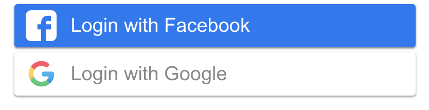

# reactjs-social-kit

> Easier login with social network platforms with `reactjs-social-kit`



[](https://www.npmjs.com/package/reactjs-social-kit)
[](https://standardjs.com)
[](http://nodejs.org/download/)
[](https://www.npmjs.com/package/reactjs-social-kit)
[](https://www.npmjs.com/package/reactjs-social-kit)

## Function

Currently this library has supported and prepared to support the following functions:
> 1.  Google
> 2.  Facebook
> 3.  Instagram (coming soon)
> 4.  Microsoft (coming soon)
> 5.  Linkedin (coming soon)
> 6.  Github (coming soon)
> 7.  Amazon (coming soon)
> 8.  Pinterest (coming soon)
> 9.  Twitter (coming soon)

## Install

Use `npm`

```bash
npm install --save reactjs-social-kit
```

Use `yarn`

```bash
yarn  reactjs-social-kit
```

## Usage

> Login with Facebook

- Create a app on Facebook Developer and get `appId` in [here](https://developers.facebook.com/apps/)

```tsx
import React, { useRef } from 'react'
import {
  ButtonLogin,
  FacebookIcon,
  FacebookLogin,
  TypeRef
} from 'reactjs-social-kit'

const App = () => {
  const facebookRef = useRef<TypeRef>(null!)

  return (
    <div style={{ width: 400, margin: '0 auto' }}>
      <FacebookLogin
        appId='xxxxxxxxxxxxxxx' // Facebook appId
        ref={facebookRef}
        onLoginSuccess={(res: any) => console.log(res)}
        onFailure={() => console.log('false')}
      >
        <ButtonLogin
          style={{ backgroundColor: '#1877F3' }}
          text='Login with Facebook'
          icon={<FacebookIcon style={{ margin: 5 }} />}
        />
      </FacebookLogin>
    </div>
  )
}

export default App
```
Props

| Property         | Type     | Default   | Description                                      |
| :--------------- | :------- | :-------- | :----------------------------------------------- |
| `onLoginSuccess` | function | undefined | Required function called on successful login.    |
| `onFailure`      | function | undefined | Optional Function called when login failed.      |
| `appId`          | string   | undefined | Required appId.                                  |
| `style`          | object   | undefined | Optional `style` overrides for root element.     |
| `className`      | string   | undefined | Optional `className` override for root element.  |
| `...`            | ...      | undefined | All other props are applied to the root element. |

> Login with Google

- Create a credential on Google Console and get `clientId` in [here](https://console.developers.google.com/apis/credentials)

```tsx
import React, { useRef } from 'react'

import {
  ButtonLogin,
  GoogleIcon,
  GoogleLogin,
  GoogleSuccessData,
  TypeRef
} from 'reactjs-social-kit'

const App = () => {
  const googleRef = useRef<TypeRef>(null!)

  return (
    <div style={{ width: 400, margin: '0 auto' }}>
      <GoogleLogin
        clientId='xxxxxxxxxxxxxxxxxxxx' // Google client id
        ref={googleRef}
        onLoginSuccess={(res: GoogleSuccessData) => console.log(res)}
        onFailure={() => console.log('false')}
      >
        <ButtonLogin
          style={{ backgroundColor: '#fff', color: '#888' }}
          text='Login with Google'
          icon={<GoogleIcon style={{ margin: 5 }} />}
        />
      </GoogleLogin>
    </div>
  )
}

export default App
```

Props

| Property         | Type     | Default   | Description                                      |
| :--------------- | :------- | :-------- | :----------------------------------------------- |
| `onLoginSuccess` | function | undefined | Required function called on successful login.    |
| `onFailure`      | function | undefined | Optional Function called when login failed.      |
| `appId`          | string   | undefined | Required appId.                                  |
| `style`          | object   | undefined | Optional `style` overrides for root element.     |
| `className`      | string   | undefined | Optional `className` override for root element.  |
| `...`            | ...      | undefined | All other props are applied to the root element. |

<br/>

## License
I'm very happy to receive suggestions and contributions from everyone <3

MIT © [dodinhthang](https://github.com/dodinhthang)(Thang Do)
